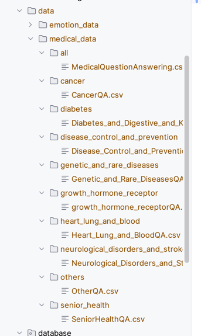

# Train vector store

- Download all datasets from here: https://www.kaggle.com/datasets/gvaldenebro/cancer-q-and-a-dataset/data
- Create src/data folder
- Place it with this structure: 

- Run `make ingest-data`
- You will need to wait for the process, it will take long time (~ 1-2 hours)

# Emotion detection

- Download the dataset here: https://www.kaggle.com/datasets/parulpandey/emotion-dataset/data
- Run `train-lstm` to train the model